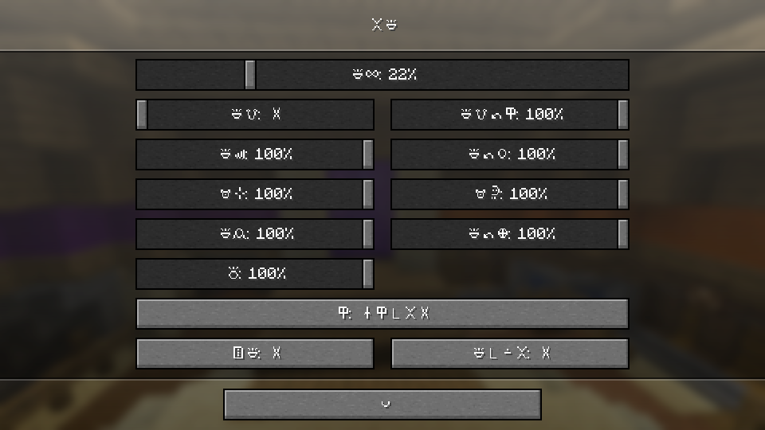

Sitelen pona is a logographic script for the cloŋ toki pona. This repository implements it for Minecraft: Simply put it in your resource pack folder, select it and set your language to "toki pona (ma pona)".

Planned features: Use ttf provider to turn player-written text into sitelen pona as well.

Sina musi pona o!

